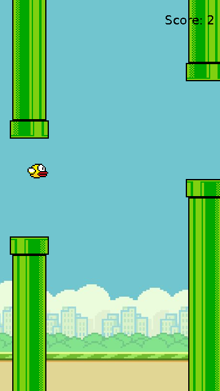

# Flappy Bird

[](https://github.com/FuaadBashi/FlappyBird/actions/workflows/ci.yml)

A Flappy Bird clone in Java Swing. Tap space to flap through the gaps between pipes; every pair
you clear scores a point.

<p align="center"></p>

## Highlights

- **Game logic independent of the UI.** `FlappyGame` holds the physics, pipe spawning, scoring and
  collision detection with no Swing dependency. `GamePanel` only draws the state and forwards key
  presses. That split is what makes the game unit-testable, headless, in CI.
- **Fixed-timestep loop.** A 60 fps Swing `Timer` advances the model one frame at a time, while a
  second timer spawns pipe pairs at random heights.
- **Tested physics.** Tests cover gravity, flapping, the ceiling, falling off screen, scoring
  through a gap, pipe collisions, off-screen cleanup, and restarting.
- **Packaged properly.** Sprites are classpath resources, so the game runs from a single jar.

## Getting started

Requires JDK 17+, Maven and a desktop session.

```bash
git clone https://github.com/FuaadBashi/FlappyBird.git
cd FlappyBird
mvn package
java -jar target/flappy-bird.jar
```

| Key | Action |
| --- | --- |
| Space | Flap |
| Enter | Restart after a crash |

## Project structure

```
src/main/java/io/github/fuaadbashi/flappybird/
├── App.java          creates the window on the Swing event thread
├── GamePanel.java    rendering, timers, keyboard input
└── FlappyGame.java   physics, pipes, scoring, collisions (no Swing)
src/main/resources/   sprites
```

## Tests

```bash
mvn verify
```

This runs the JUnit suite and checks formatting with google-java-format.
